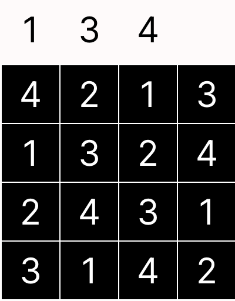
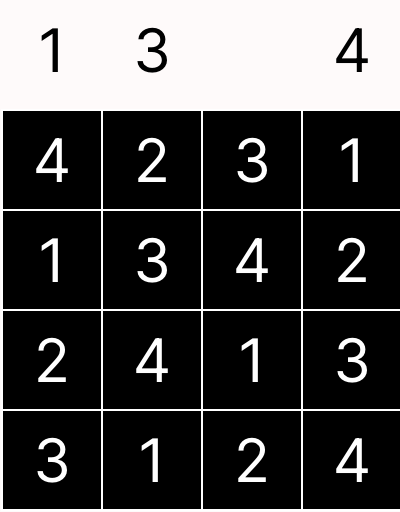
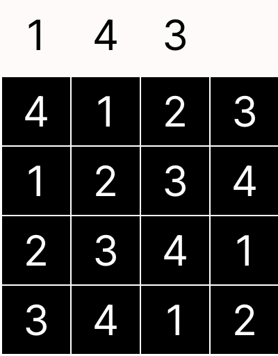
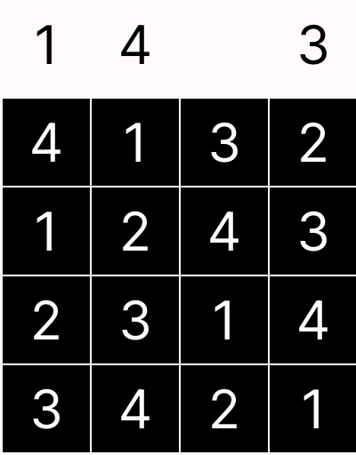
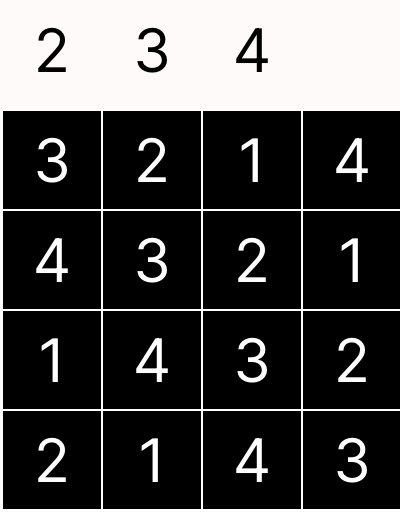
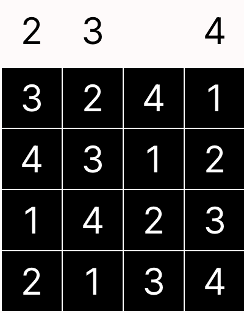

# Skyscraper
Skyscraper Puzzle Solver

We were most curious about the relationship between skyscraper puzzle constraints and the kinds of boards that can be created to solve those constraints. We set out to make a Forge model which can accurately describe and solve Skyscraper Boards, use that model to find boards with unique solutions, and also to experiment with other kinds of constraints that can be added on top of the original Skyscraper-style constraints (AltSkyscaper).

In the end, the model could accurately find solutions to a given set of constraints in both versions of Skyscraper. Moreover, it was used to identify boards with unique solutions with various hint arrangements. Finally, the model also demonstrated usability to identify "isometric" boards - given a Skyscraper board with only exterior constraints, it can identify AltSkyscraper boards (with only interior constraints) where a solution in the original board will always be a solution in the AltSkyscraper board.
#

## What can you do?
A user can specify a set of puzzle constraints and determine if a solution exists as well as find all distinct solutions.

A user can also/alternatively specify a particular arrangement of the board's numbers and find sets of constraint(s) which are solvable and preserve the given arrangement. For example, you could specify that the main diagonal is all 4's, and then use the model to find various sets of constraints with solutions that satisfy that setup.

A user can search for boards that have a unique solution. Using the model (and Forge) as a Racket library, a user can feed in boards with specified constraints and automatically determine whether or not the solution (if one exists) is unique. By essentially programatically clicking the Sterling "next" button, one can search for combinations of constraints which have unique solutions. This is a higher-order quantification (sort of a "meta-predicate") which is generally not feasible in Forge, but by being smart about isomorphisms (relective and rotational symmetries), the number of truly "unique" constraint combinations can be reduced such that the cost is reasonable.

A user can experiment with "translating" a board from Skyscraper to AltSkyscraper (and vice versa) - given a board in one version you can use the model to find constraints in the other version that are necessary for a solution. For example, you could provide a Skyscraper board and then use the model to find a corresponding AlySkyscraper board - any solution to the first board will also be a solution to the second board.

## What you _can't_ do...

Another thing we were curious about was whether or not you would ever need to guess in a given skyscraper puzzle, or if the constraints were sufficient to fully decide the board. The idea was going to be a temporal model which fills in cells of a given Skyscraper puzzle one at a time following the rules and eliminating possiblities as it goes. It would indicate to the user when it was forced to make a guess on a cell (i.e. if there was no cell that had only one possible option). This turned out to be infeasible because it would basically require us to encode a human solver in Forge rather than just encoding the parameters of the game. Such a project would probably be better suited for another programming language which attempted to solve these puzzles through coding a human solver's strategies.

#
## Design Choices:

### Sigs:
The model of the original skyscraper puzzle has the following sigs and fields:

    Cell
    - cell_row : one Int
    - cell_col : one Int
    - val : one Int

    abstract Wall

    Top extends Wall
    Bot extends Wall
    Lft extends Wall
    Rgt extends Wall

    Board
    - position : pfunc Int -> Int -> Cell
    - size : one Int

    Constraint
    - wall : one Wall
    - index : one Int
    - hint : one Int

AltSkyscraper, a new puzzle we experimented with, had Skyscraper-like constraints inside of the board as well as the original perimeter constraints. Thus, the original constraint sig became abstract and the following sigs were added:

    abstract Constraint
    - wall : one Wall
    - hint : one Int

    WallConstraint extends Constraint
    - index : one Int

    InteriorConstraint extends Constraint
    - const_row : one Int
    - const_col : one Int

With the above setup, the "Wall" field of each constraint determines which edge of the board the hint is "looking from". That is, a constraint along the top edge on the first column would have wall=Top and index=0. For interior constraints, the constraint would be applied following the same direction logic except the constraint would be applied starting at the indicated row/col position _including_ that cell.

### Predicates:

The most important predicates for the model(s) are:
    
- boardSetup[size : Int]
  - Set up the logistics of a square board with given size (ex: all cells are in disjoint positions) as well as logic which is not specific to a particular set of puzzle constraints (ex: all vals in a row/col are different).

- addConstraint[w:Wall, i:Int, h:Int]
  - Asserts that there exists a constraint with the provided parameters. This is used to specify a specific set of puzzle constraints to be satisfied.

- satsConstraints and obeysConstraint[c : Constraint]
  - satsConstraints uses obeysConstraint to assert that each puzzle constraint is satisfied in the final solution board.
  - In AltSkyscraper, obeysConstraint was broken into obeysWallConstraint and obeysInteriorConstraint to support both types of hints.

- canBeSeen[c : Cell, w: Wall]
  - Predicate which determines if a given cell can be seen from a given wall by checking if all cells between c and the wall are shorter than c. 
  - In AltSkyscaper, this predicate additionally takes in an index which specifies the position at which we are "starting" from, to support constraints which do not start at the edge of the board.

### Design Tradeoffs:

- Constraints as sigs:
  - Having constraints represented by sigs allowed us to use our skyscraper solvers bidirectionally: you could either specify constraints and use the model to find solution boards, or you could specify parts of the board and ask the model to generate valid constraints. This was not something we anticipated going into the project but it was interesting to have a single model which allowed us to explore both the constraint setup as well as the solution aspects of the puzzle.
  - Constraints as a sig also caused some problems. When trying to find boards with unique solutions, having the Constraint sig made it difficult for Forge to identify symmetries in runs (ex: it would return "two" valid solutions to a board which were identical in the cell values but had swapped constraint names or something similar). This was a huge problem when using Forge to find unique boards because we needed the Forge solving engine to identify these solutions as identical. We wrote a V2 version of (Alt)Skyscraper which, instead of using sigs, enforced constraints by feeding the parameters in directly - this eliminated this problem and allowed us to find unique boards properly.

- Limited Board Size
  - Board size was a huge bottleneck on the feasability of the model. For one, there was boundary on the size of the hints/board positions from the Forge bit width (upper limit of 8x8 boards), but also increasing board size greatly increased run time. 4 was chosen as a standard because it was big enough to be interesting but small enough to be reasonable. We had success with run statements supporting up to 6x6 boards in reasonable time. 

## Some Results

The model was able to find boards with 3 and 4 single-sided constraints that had strictly unique solutions. It also ruled out that boards with only 1 or 2 constraints (regardless or relative position) never have a unique solution in original Skyscraper. Regrettably, there was not enough time to consider other more complicated constraint arrangements (ex: multisided 3 constraints and beyond).

#

     

##### Examples of 3 constraint single-sided boards with unique solutions.
#

In total, for boards with only 3 constraints on a single side, 192 were found to have a unique solution. The model searched only the  "bases" of all such boards: any 3 constraint single-sided board can be rotated/flipped to one of 128 "basic" forms, and out of those forms the model found 24 which had unique solutions. Each of these "basic" unique solutions can itself be flipped and rotated to make another unique solution board - thus the final count is 24 * 2 * 4 = 192 (2 from flipping horizontally, 4 from rotating).

Interestingly, in the limited testing of isomorphism between Skyscraper and Altskyscraper hints, the model seemed to suggest that the interior constraints of a solution are constant. That is, if you take any Skyscraper puzzle, then every solution to that puzzle will have identical "interior constraints". Below is a visual representation of what that means:

TODOTODOTODO example: given skyscraper board w mult solution, then show all interior constraints, then show other solutions to the board whcih also satisfy those constraints. 

Essentially, it is impossible to satisfy all the exterior constraints without also satisfying each individual interior constraint. This is an interesting finding since it means that the representation of a Skyscraper game might be fully explicable using only AltSkyscraper constraints.

All of these results were for 4x4 boards. There may be different findings for other board dimensions.

instance -> you can use our setup to input your own constraints, use the viz script to view the board and hints, can click next to find other valid solutions if any

You should write a one page README describing how you structured your model and what your model proved. You can assume that anyone reading it will be familiar with your project proposal. Here are some examples of points you might cover:

What tradeoffs did you make in choosing your representation? What else did you try that didn’t work as well?
What assumptions did you make about scope? What are the limits of your model?
Did your goals change at all from your proposal? Did you realize anything you planned was unrealistic, or that anything you thought was unrealistic was doable?
How should we understand an instance of your model and what your custom visualization shows?
